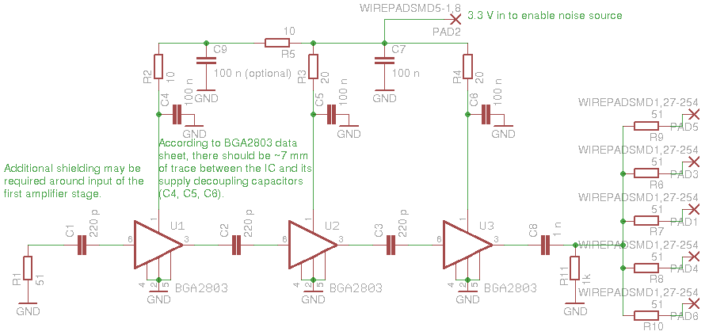

Schematics and PCB designs for parts of improved hardware.
PCBs have been designed using eagle.

noisesource.sch is the schematic for a better noise source based on three
BGA2803 MMICs. This MMIC was chosen because it has almost flat gain up to
2 GHz, works on 3.3 V and consumes relatively little current. Linearity
and noise figure are not important here.

noisesource.brd is a PCB design which has been built on a homemade PCB
and works. The positions of ground vias in the design don't exactly
correspond to what was built. Consider adding more vias near edge of the
board if you decide to order PCBs from somewhere.

The noise source hasn't been tested as a part of the coherent rtl-sdr setup
yet but it should work well and will be tested soon.
